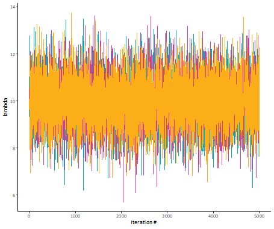

**Keywords** — Bayesian Statistics, Monte Carlo, Markov Chain, MCMC, Stan, Forecasting, Predictions, Behavioral Economics

# 1. Introduction

A lot has been written in the actuarial literature about Bayesian statistical methods over the last few decades; few of which are still part of current exam syllabi. While these papers provide a thorough explanation of the process, the math can seem overly complex even to an experienced actuary. The purpose of this paper is twofold. First, we want to provide actuaries with the *basic* understanding of what goes on behind the scenes of a Bayesian model without getting bogged down in the math. Second, we want to champion the continued inclusion of these topics on exam syllabi in the future.

While we believe this paper is beneficial to everyone in the profession, we view the following as the target audience:

-   An actuary who has finished exams a few years ago and wants to ease their way into Bayesian methods.
-   An actuary who occasionally finds their estimates to be out of line with results with no discernible reason.
-   An actuary interested in learning about Bayesian methods but finds the math too onerous or intimidating.
-   An actuary with limited data.

In Section 2, we give a brief lesson in behavioral economics and highlight potential biases that are relevant to the actuarial profession.

In Section 3, we review a few common methods of making predictions and examining their strengths and weaknesses.

In Section 4, we give a primer on the basics of Bayesian statistics and introduce Markov Chain Monte Carle (MCMC) methods.

In Section 5, we use a real-life example to show how the underlying biases in Section 2 can impact some of the prediction methods from Section 3 and how using Bayesian methods can provide a more realistic range of reasonable estimates.

In Section 6, we provide the reader with additional resources to further explore these topics.

# 2. A Lesson in Behavioral Economics

When making predictions, people often rely on heuristics. While these are typically useful from an evolutionary standpoint, they can "... lead to systematic and predictable errors". Below is a non-exhaustive list of possible factors at play when making actuarial predictions along with key examples (Tversky & Kahnemann).

## 2.1 Insensitivity to sample size

If tasked with estimating the likelihood of a particular result, people tend to base their estimate on the sample's similarity to the population's likelihood, regardless of sample size.

For example, subjects were given the following problem:

> A certain town is served by two hospitals. In the large hospital about 45 babies are born each day, and in the smaller hospital about 15 babies are born each day. As you know, about 50% of all babies are boys. The exact percentage of baby boys, however, varies from day to day. Sometimes it may be higher than 50%, sometimes lower.
>
> For a period of one year, each hospital recorded the days on which more than 60% of the babies born were boys. Which hospital do you think recorded more such days?
>
> \- The larger hospital
>
> \- The smaller hospital
>
> \- About the same (i.e., within 5% of each other)

The majority of subjects said the numbers of days would be about the same, while the minority of subjects were split evenly between the larger and smaller hospitals. According to sampling theory, there will be more such days in the smaller hospital since smaller populations generally experience higher variation.

For a more salient example, consider the actuary's task of estimating the prospective loss ratio for a given book of business when they only have two years of data. If the industry and historical loss ratios for that exposure are both consistently in the 75-80% range, you might expect the prospective loss ratio for your book and the industry to be similar. However, the volatility in loss ratios will be greater for your book than for the industry.

## 2.2 Insensitivity to the prior probability of outcomes

When making a judgment of whether item X belongs to either class A or class B, people will assign it to the class in which the description of item X matches the stereotype of the class, despite the relative likelihood of each class.

For example, when subjects were tasked with evaluating the likelihood of whether a randomly sampled person out of a pool of 30 engineers and 70 lawyers was a lawyer or an engineer, subjects correctly identified the relative likelihoods. However, when a description of the randomly sampled person was introduced, subjects "evaluated the likelihood that a particular description belonged to an engineer rather than to a lawyer ... with little or no regard for the prior probabilities of the two outcomes." Under this new condition, subjects estimated the likelihood to be 50/50.

## 2.3 Misconception of chance

People will expect even a short sample of random events to "look random." For example, when shown two sets of a random sequences of coin tosses, subjects will judge "HTHTTH" to be more likely than "HHHTTT", despite the two sets being equally likely.

For an example from our profession, consider the task of selecting trend rates. While we try to incorporate external information in our selections (hard versus soft market, inflation, changes in business practices, etc.), there will always be a tendency to "eyeball" trend lines - even when the data points have no clear trend.

While we would like to believe actuaries would be immune to this particular bias, even experienced research psychologists were prone to believing "... small sample sizes were highly representative of the populations from which they are drawn."

## 2.4 Insensitivity to predictive accuracy

When making predictions, studies show that when given only a favorable or unfavorable description of something, subjects' predictions were "insensitive to the reliability of the description." In other words, people can take a description at face value, with little regard to the credibility of the description.

Consider the following example. You are tasked with estimating the average ultimate severity of claims occurring during the upcoming policy year. The recently hired risk manager tells you that there are new post-loss measures being put in place that will reduce the potential of large claims. Taking the risk manager’s assessment of the new claims handling process on faith could lead to deficient estimates.

## 2.6 Misconceptions of Regression

This is more commonly referred to as "regression to the mean." If we observe a string of higher than average values within a known distribution, one would expect lower than average values in the next few observations. However, studies show that many subjects do not always recognize this phenomenon. They can either fail to believe regression is applicable in their specific scenario or they might "invent spurious causal explanations."

## 2.7 Anchoring

Suppose you're in charge of providing a loss forecast for the upcoming accident year and have been doing so for a few years. When making your selection, you are acutely aware of the estimate you provided last year. This prior estimate might be "anchoring" your estimate of the prospective year. While that may not be a bad thing, the issue arises when there is insufficient adjustment to the anchoring value.

In one study, subjects were tasked with estimating the percentage of African countries in the United Nations. However, before making their estimate, the subjects were asked to spin a wheel with numbers from 0 to 100. The subjects had to adjust upwards or downwards from this starting value. The median estimate for those with a starting value of 10 was 25% compared to 45% for those with a starting value of 65.

# 3. Statistical Models

The "actuarial central estimates" is a cornerstone of our profession. It reflects the culmination of years of studying and practice. For a lot of our work, it's all that is typically required. After all, we're seen as the experts and you'd be hard-pressed to find an end user of our work that is as concerned about confidence levels as we are.

But as we each have likely missed the mark on some projection at some point in our careers, it is worth reflecting on those misses. Were they due to chance (e.g., process risk), did we fail to adequately capture possible alternatives (e.g., parameter risk), or was there some underlying bias that caused us to see a trend that wasn't actually there.

## 3.1 A Review of Risks

**--- This section needs some expansion ---**

A refresher on types of risk is required (Meyers):

-   Process Risk: Average variance of the outcomes from the expected results.
-   Parameter Risk: Variance due to the many possible parameters.
-   Model Risk: The risk that one did not select the right model.

## 3.2 Statistical Schools of Thought

Two major schools of statistical thinking are 1) Frequentist and 2) Bayesian.

Frequentist statistics is a type of inference that defines probability based on (as the name implies) an events frequency from a repeatable experiment.

Bayesian statistics may sound familiar to you, as the core of Bayesian statistics is an idea called Bayes theorem which most people would have learned in an introductory statistics course.

Most people, and specifically actuaries, rely on frequentist statistics for their analyses. Some of the main distinctions between the two types of inference are:

| Frequentist                                                                                                | Bayesian                                                                          |
|-----------------------------------------|-------------------------------|
| Fundamentally believe that observations are repeatable random events                                       | Fundamentally believe that observations are a known fixed sample                  |
| Parameters have fixed values                                                                               | Parameters are unknown                                                            |
| Have an objective view on probability                                                                      | Have a subjective view on probability                                             |
| Calculate the probability of observing events based on distribution given a set of parameters (likelihood) | Describe parameters probabilistically based on observations and prior assumptions |
| Less computationally intensive                                                                             | Computationally intensive                                                         |

Upon reviewing these fundamentals, we would argue that actuarial math (as with most predictive statistics) is inherently Bayesian at its core. As actuaries, we know historical claim information and can say that claims and events are a known fixed sample of observations. When predicting future claims or development on claims, we don’t know the parameters under which circumstances are to arise, however, given the historical information and our expertise we can describe some basis of prior assumption about the parameters. Finally, as we want to capture as much risk in our modelling as possible, a frequentist approach typically lacks parameter risk if parameters are fixed.

As such, Bayesian statistics can greatly improve actuarial models by incorporating parameter risk without really changing our view on information we know. Bayesian methods also allow for the incorporation of prior knowledge (or what we like to call actuarial judgement) into our prior assumptions to influence our models. Lastly, technological advances have also made Bayesian modeling more accessible by minimizing the computationally intensive hurdles.

# 4 Bayesian Statistical Modelling

## 4.1 Basics of Bayesian Statistics

As mentioned previously, the foundation of Bayesian statistics is Bayes' Theorem. To give a brief refresh on what Bayes' theorem is and how it works; Bayes' theorem tells you how to adjust our prior assumption to get a new updated assumption (posterior) accounting for thew new information we provide (historical evidence) and it is represented as the formula below.

$P(Y|X) = \frac{P(X|Y)}{P(X)} = \frac{f(X|Y)(f(Y)}{\int_{-\infty}^{\infty} f(X|Y)(f(Y)dy} = \frac{f(data|\theta)*f(\theta)}{\int f(data|\theta)*f(\theta)d\theta}$

We can break Bayes' theorem down into 4 components:

1.  The likelihood $f(data|\theta)$: the probability of the data given a set of parameters
2.  The prior $f(\theta)$: the probability distribution of the parameters
3.  The evidence $\int f(data|\theta)*f(\theta)d\theta$ : the likelihood of the data given all potential parameters in the distribution (*this integral can become very difficult to calculate*)
4.  The posterior $P(\theta|data)$: the result, the modified probability of the parameter space after accounting for the data.

A very important concept here is that applying Bayes' theorem in this way gives us probabilities of the parameter space. We do not get a result of the potential observations. Below we visualize what is happening with Baye’s theorem in this context: we are producing an updated posterior, given the prior information and the likelihood.

{width="513"}

## 4.2 Markov Chain Monte Carlo (MCMC)

MCMC is an effective way of using Bayesian statistics in actuarial models. By effective, we may you can use these methods so you no longer need to deal with the complex integral in the denominator of Bayes' theorem Lets start by breaking down the term Markov Chain Monte Carlo:

-   A **Markov process** is a random process for which the future outcomes depends only on the present state.

-   **Monte Carlo** methods use random sampling to approximate an outcome.

-   Putting **Markov process** and **Monte Carlo** methods together, MCMC is a way to gather a representation of the true but incalculable posterior distribution via simulation and repeated sampling

It is easy to think about these two items separately but what might an example of this look like in action?

Lets imagine we have a single frog on a pond covered in lily pads. The frog can jump from one lily pad to any of the other lily pads in the pond. The frog is more likely to jump to lily pads that are closer to them, but they can certainly hop all the way across the pond to another lily pad. The frog wants to find a good lily pad to sit on and get sunlight.

Which lily pad the frog jumps to from its current lily pad is random, but certain lily pads are more likely because they are closer than lily pads that are further away. Another way of thinking about this that the next lily pad the frog jumps to has a distribution about it that is dependent only on the lily pad that the frog is currently on (i.e., this is a Markov process!).

Now, when the frog jumps to a new lily pad, the decision to stay on that lily pad is dependent on how much the frog likes that lily pad. The frog likes a lily pads based on how much sunlight they get there. This is merely a likelihood function! If the frog doesn’t like how much sunlight they get at the new lily pad, the forgetful frog ignores they ever jumped to it and goes back to the lily pad they jumped there from before jumping again.

It’s an indecisive frog so they don’t want to stay on the same lily pad, and so the frog will keep jumping around all day long from lily pad to lily pad (i.e., this a Monte Carlo process!). At the end of the day, the frog will have spent more time on lily pads that got the most sunlight and they preferred, and less time at those in the shade that weren’t the right fit for the frog.

Hopefully, this is starting to paint a picture of how what an MCMC process looks like and how the Markov chain and Monte Carlo simulation pieces fit together.

Extrapolating this example out to statistical terms, if we think about the lily pads as being different parameter spaces, the frog jumps around from parameter space to parameter space trying to find one that fits the frog’s needs well. We can think about the frog liking a certain lily pad as how well does the parameter space (the given lily pad) describe the observed data (the amount of sunlight). This is just a likelihood function (i.e., what is the likelihood of the data given the parameter space), and in an MCMC simulation if that likelihood is above or below some random simulated threshold, we will accept or reject the parameter space (e.g., will the frog stay at that lily pad or go back to the one they jumped there from). Finally, by the frog jumping around from lily pad to lily pad all day long, and if we observe which lily pads the frog goes to all day, we can end up with a distribution of which lily pads the frog liked best. Or in statistical terms, which parameter spaces that were most likely to describe the data.

This silly example is a version of the Metropolis-Hastings algorithm, which is a form of an MCMC process. There are several forms of MCMC processes: Gibbs sampling, Metropolis Hastings, Hamiltonian Monte Carlo, etc. The specifics of how each one works are beyond the scope of this paper.

## 4.3 Execution of MCMC

This process can be done using Stan, an open-source software, via common coding languages (e.g., python and R). Later in this paper we dive into a comparison of MCMC fits verse traditional methods and provide a real example of fitting an MCMC process. In this paper, we leverage the RStan package, though there are numerous other packages that can be used (RStan leverages Hamiltonian Monte Carlo).

In order to assess the model fit of a MCMC model, there are several diagnostics you can look at. There are many parameters that help in the simulation process of MCMC (e.g., thinning), most of which are beyond the scope of this paper. However, two related parameters that are important to assessing model fit are iterations and chains. Iterations are simply the number of times you want the Monte Carlo process to repeat itself. Chains however, break up the iterations into segments. For example if we wanted to have 30,000 iterations, we could break this up into 3 chains of equal length of 10,000 iterations each. When a new chain is started, the Markov process starts from a new spot. In this example, we would have 3 random starting locations before beginning the 10,000 iterations each. This helps in understanding if the initial starting point influences the convergence of the chain (see discussion on trace plots below for more understanding).

Some model diagnostics to help assess the model fit.

-   R-hat, also known as the Gelman-Rubin statistic, is a diagnostic that is used to assess the convergence of the simulation. It is calculated as the square root of the ratio of the variance between simulation chains to the variance within the chains. A well converging model will have an R-hat statistic close to 1.0, as is implied by the formula that the variance between chains is relatively equal to the variance within a chain.

-   Effective Sample Size (N-eff) tests the correlation of the sampling done in the simulation. Since it is a Markov chain and the next iteration is dependent on the current starting position, there is going to be correlation between samples. The effective sample size statistic helps identify how much correlation occurs during the sampling through the following formula:

    $ESS = \frac{n}{1 + 2*\sum_{k=1}^{\infty} \rho (k)}$

    Where n is the number of iterations and $\rho (k)$ is the correlation at lag k. We want a higher effective sample size relative to the number of total iterations in the simulation. For example, if we ran a model with 10,000 iterations, an effective sample size of 7,000 could be considered a positive sign that there is low correlation in the model, and an effective sample size of 200 would indicate that there is high correlation in the model.

-   Trace plots show the results of the MCMC model in sequential order of the simulation. Since the output of our model is parameter estimates, we would create a trace plot for each parameter with the iteration number as the x-axis and the corresponding simulated parameter value as the y-value and draw a connecting line so we can see the path of the simulation. Ideally, we would want a trace plot to appear random, like white noise, as a sign of well mixing models and well converged chains. Below comparing the left and right plot, the left plot is an example of well mixed trace plot result, the points appear random, no specific pattern in the lines, and all 3 chains are converging over the same region. The plot on the right is a not well mixed model, as we see the orange line has a much higher mean across all iterations than the pink or blue lines.

    {width="250"}{width="250"}

# 5. An Example in Action

For our example, let's assume you are tasked with estimating the expected frequency of earthquakes over 6.0 magnitude for the upcoming year (2012). You are given a dataset of prior earthquakes since 1983.

First, let's get the data we'll be using in our example. Below is the history for 1983 through 2011.

```{r data_by_year, echo=FALSE, warning=FALSE, fig.width=6, fig.height=4}
options(scipen = 999)

data(eqlist, package = 'CASdatasets')

df <- data.table::as.data.table(eqlist)[
  mag >= 6.0, 
  .(count = .N),
  keyby = .(year = lubridate::year(day))
]

prosp_year <- 2012

counts <- df[year %in% 1983:(prosp_year - 1)]

true_count <- df[year == prosp_year, count]

gg_orig <- ggplot2::ggplot() +
  ggplot2::scale_x_continuous(name = 'Year', breaks = seq(1983, 2012, 3)) +
  ggplot2::scale_y_continuous(name = '') +
  ggplot2::theme_minimal() +
  ggplot2::theme(
    panel.grid.minor.x = ggplot2::element_blank(),
    panel.grid.minor.y = ggplot2::element_blank()
  ) +
  ggplot2::labs(title = 'Frequency of 6.0 Maginitude Earthquakes') +
  ggplot2::geom_col(
    data = counts,
    mapping = ggplot2::aes(
      x = year,
      y = count
    ),
    color = 'black',
    fill = 'lightgrey',
    alpha = 0.5
  )

gg_orig
```

```{r point_estimate, include=FALSE}
point_estimate <- mean(counts[year >= prosp_year - 5, count])
```

In the simplest case you may decide given the recent trend, that the five-year average is the best approximation of future frequency. In this case, your selected frequency is `r round(point_estimate, 2)` ("Point Estimate").

Your next logical step might be to add some process risk around your estimate by fitting a distribution to the data. Based on an examination of the data, you decide to model frequency using the Poisson distribution with lambda = `r round(point_estimate, 0)`.

```{r process_risk, include=FALSE}
process_risk_lambda <- point_estimate

set.seed(314159)
iterations <- 10000

process_risk_sample <- stats::rpois(n = iterations, lambda = process_risk_lambda)

process_risk <- mean(process_risk_sample)
```

After running 10,000 simulations with your selected distribution, you're left with a central estimate of `r round(process_risk, 2)`. Not surprisingly, this is essentially the same as your point estimate. However, you now have a predictive distribution.

Another possible step would be to layer in parameter risk since we might not be convinced of our selected lambda. You decide on letting lambda follow a chi-square distribution with degrees of freedom equal to your point estimate.

```{r parameter_risk, include=FALSE}
set.seed(314159)

parameter_risk_lambda <- stats::rchisq(n = iterations, df = point_estimate)
# summary(parameter_risk_lambda)

parameter_risk_sample <- purrr::map_dbl(
  .x = 1:iterations, 
  .f = function(i) stats::rpois(n = 1, lambda = parameter_risk_lambda[i])
)
# summary(parameter_risk_sample)

parameter_risk <- mean(parameter_risk_sample)
```

After running another 10,000 simulations, you're left with a central estimate of `r round(parameter_risk, 2)`. Even though we let lambda vary, the result is still quite close to the point estimate.

But as we discussed earlier, there are a few problems with just relying on our data:

-   The sample size is on the low end (n = `r nrow(counts)`).
-   Regression to the mean.
-   It might look like there is a "new normal" but you could be seeing a trend where there isn't one.

How do we handle these possible biases? That's where Bayesian MCMC comes in. We'll continue with the distribution from our parameter risk model.

```{r bayesian, include=FALSE}
bayesian_stan_model <- rstan::stan(
  model_code = '
      data{
        int<lower = 0> N;
        int obs[N];
        real<lower = 0> df;
      }
      
      parameters {
        real<lower = 0> lambda;
      }
    
      model {
        lambda ~ chi_square(df);
        
        for(i in 1:N) {
          obs[i] ~ poisson(lambda);
        }
      }
    ',
  data = list(
    N = nrow(counts), 
    obs = counts$count,
    df = point_estimate
  ),
  chains = 2,
  iter = 10000,
  warmup = 5000,
  seed = 314159
)

# rstan::summary(bayesian_stan_model)

bayesian_lambda <- rstan::extract(object = bayesian_stan_model, pars = 'lambda')[[1]]

# summary(bayesian_lambda)

set.seed(314159)

bayesian_sample <- purrr::map_dbl(
  .x = 1:iterations, 
  .f = function(i) stats::rpois(n = 1, lambda = bayesian_lambda[i])
)

bayesian <- mean(bayesian_sample)
```

After running 10,000 simulations with your selected distribution, you're left with a central estimate of `r round(bayesian, 2)`. Since you used a wide prior, your result will be closer to the historical average (`r round(mean(counts$count), 2)`) than the point estimate (`r round(point_estimate, 2)`).

Let's compare each result to the true number of earthquakes that occurred in 2012 (`r true_count`).

```{r compare_true, echo=FALSE, fig.width=6, fig.height=4}
ggplot2::ggplot() +
  ggplot2::theme_minimal() +
  ggplot2::theme(
    legend.position = 'bottom',
    panel.grid.minor.x = ggplot2::element_blank(),
    panel.grid.minor.y = ggplot2::element_blank()
  ) +
  ggplot2::scale_x_continuous(name = 'Counts') +
  ggplot2::scale_y_continuous(name = 'Cumulative Probability', labels = scales::percent) +
  ggplot2::scale_color_manual(
    name = '',
    labels = c(
      'A' = 'Actual', 
      'B' = 'Point Estimate', 
      'C' = 'Process Risk', 
      'D' = 'Parameter Risk', 
      'E' = 'Bayesian'
    ),
    values = c(
      'A' = '#FF8C00',
      'B' = '#8096B2',
      'C' = '#76D3FF',
      'D' = '#009DE0',
      'E' = '#002C77'
    )
  ) +
  ggplot2::geom_line(
    mapping = ggplot2::aes(
      x = sort(process_risk_sample),
      y = ecdf(process_risk_sample)(sort(process_risk_sample)),
      group = 1, color = 'C'
    )
  ) +
  ggplot2::geom_line(
    mapping = ggplot2::aes(
      x = sort(parameter_risk_sample),
      y = ecdf(parameter_risk_sample)(sort(parameter_risk_sample)),
      group = 1, color = 'D'
    )
  ) +
  ggplot2::geom_line(
    mapping = ggplot2::aes(
      x = sort(bayesian_sample),
      y = ecdf(bayesian_sample)(sort(bayesian_sample)),
      group = 1, color = 'E'
    )
  ) +
  ggplot2::geom_line(
    mapping = ggplot2::aes(x = rep(point_estimate, 2), y = c(0, 1), group = 1, color = 'B'),
    linetype = 'dashed'
  ) +
  ggplot2::geom_line(
    mapping = ggplot2::aes(x = rep(true_count, 2), y = c(0, 1), group = 1, color = 'A'),
    linetype = 'dashed'
  )
```

It appears that all four methods severely underestimated the true average losses. However, if we look at the Bayesian versus the other three, the true count is a more likely outcome. The "true count" is approximately equal to the `r scales::percent(length(bayesian_sample[bayesian_sample <= true_count]) / iterations, accuracy = 0.1)` confidence level of our Bayesian estimate. While this may still seem low, it is relatively close to the proportion of counts below `r true_count` (`r scales::percent(length(counts$count[counts$count <= true_count]) / nrow(counts), accuracy = 0.1)`).

Additionally, there are essentially no "extreme" values (225+) being simulated.

With the benefit of hindsight, let's see why we overestimated the true counts in all four methods. As it turns out, we fell prey to (at least) two key biases:

-   Humans just aren't that great at identifying random processes. For example, a series of coin tosses with all heads is seen as "less random" than a series with alternating heads and tails, even though both results are equally likely.
-   As seen in the chart, the high average for 2007-2011 was followed by a low average in 2012-2023. This resulted in the new all-year average (1983-2023) being nearly identical to the all-year average before the rise (1983-2006).

```{r plot_full, echo=FALSE, fig.width=6, fig.height=4}
gg_orig +
  ggplot2::geom_col(
    mapping = ggplot2::aes(
      x = prosp_year,
      y = true_count
    ),
    color = 'black',
    fill = 'lightblue'
  ) +
  ggplot2::geom_col(
    data = df[year %in% (prosp_year + 1):2023],
    mapping = ggplot2::aes(
      x = year,
      y = count
    ),
    color = 'black',
    fill = 'white'
  )
  
```

# 6. Supplemental Information

## 6.1 Literature Review

While our paper focused on the usage of Bayesian MCMC methods for forecasting purposes, the methods can and have been used in other applications. We provide a non-exhaustive list below of papers that utilize these methods to some extent:

-   Trends (Schmid)
-   Reserving (Meyers 2015)
-   Renewal Functions (Aminzadeh & Deng)
-   Risk Margins (Meyers 2019)
-   Incorporating expert opinion into traditional reserving methods (Verrall)

We also believe there are several other possible applications, ranging from the selection of development factors to estimating reserve variability. We leave it to the reader to explore these.

## 6.2 Acknowledgements

We would like to extend our gratitude to our colleagues for their thoughtful reviews.

## 6.3 Biographies of the Authors

Spencer is a Senior Manager with Oliver Wyman Actuarial Consulting, Inc., located in Philadelphia. He holds a Bachelor of Science from Lebanon Valley College. Spencer is a Fellow of the Casualty Actuarial Society and a Member of the American Academy of Actuaries.

Kenny is a Senior Manager with Oliver Wyman Actuarial Consulting, Inc, located in Chicago. He holds a Bachelor of Science degree in Actuarial Mathematics and Statistics from the University of Pittsburgh. Kenny is a Fellow of the Casualty Actuarial Society and a Member of the American Academy of Actuaries.

## 6.4 Citations

**--- Need citations for KS sections ---**

A. Tversky, and D. Kahneman. 1974. "Judgment Under Uncertainty: Heuristics and Biases." Science 185, 1124–1131.

Aminzadeh, M.S., and Min Deng. 2022. “Bayesian Estimation of Renewal Function Based on Pareto-Distributed Inter-Arrival Times via an MCMC Algorithm.” Variance 15 (2).

Meyers, G. 2015. “Stochastic Loss Reserving Using Bayesian MCMC Models.” CAS Monograph #1.

Meyers, G. 2019. “A Cost-of-Capital Risk Margin Formula for Nonlife Insurance Liabilities.” Variance 12 (2).

Sahasrabuddhe, R. 2021. "The Single Parameter Pareto Revisited." Casualty Actuarial Society E-Forum, Spring 2021.

Schmid, F. 2013. "Bayesian Trend Selection." Casualty Actuarial Society E-Forum, Spring 2013.

Verrall, R. J. 2007. "Obtaining Predictive Distributions for Reserves Which Incorporate Expert Opinion." Variance 1 (1).

## 6.5 R Packages

Barrett, Tyson, Matt Dowle, Arun Srinivasan, Jan Gorecki, Michael Chirico, Toby Hocking, Benjamin Schwendinger, and Ivan Krylov. 2025. “Data.table: Extension of ‘Data.frame‘.” <https://CRAN.Rproject.org/package=data.table>.

Dutang, Christophe, and Arthur Charpentier. 2025. “CASdatasets: Insurance Datasets.” <https://doi.org/10.57745/P0KHAG>.

Stan Development Team. 2025. “{RStan}: The {r} Interface to {Stan}.” <https://mc-stan.org/>.

Wickham, Hadley. 2016. “Ggplot2: Elegant Graphics for Data Analysis.” <https://ggplot2.tidyverse.org>.

## 6.6 Example Code

In this section, we provide a sample template for using the `rstan` package in R. The specific case demonstrated will be the estimation of accident year 2024 indemnity claim frequency (per 1,000 employees) in the state of California. We'll use the last 20 years from the WCIRB's 2025 State of the System Report.

```{r example_code, eval=FALSE, include=TRUE}
# raw data

historical_frequencies <- data.table::data.table(
  year = c(2005, 2007, 2009, 2011, 2013, 2015, 2017, 2019, 2021, 2022, 2023),
  rate = c(16.411, 15.005, 14.127, 15.052, 15.572, 15.311, 14.408, 14.279, 15.521, 15.147, 16.055)
)

# bring the rate to 2024 levels - indicated trend is minimal, assume 0%

stats::lm(data = historical_frequencies, formula = log(rate) ~ year)

historical_frequencies[, freq_trend := 1.00 ^ (2024 - year)]

historical_frequencies[, onlevel_rate := rate * freq_trend]

# best fit = Gamma

library(EnvStats)

EnvStats::distChoose(
  y = historical_frequencies$onlevel_rate,
  choices = c('gamma', 'lnorm', 'norm', 'weibull')
)

ggplot2::ggplot(mapping = ggplot2::aes(sample = historical_frequencies$onlevel_rate)) +
  ggplot2::theme_minimal() +
  ggplot2::coord_cartesian(
    xlim = c(13.5, 16.5),
    ylim = c(13.5, 16.5)
  ) +
  ggplot2::scale_color_manual(
    name = 'Distribution',
    values = c(
      'lognormal' = 'red',
      'normal' = 'green',
      'gamma' = 'blue',
      'weibull' = 'purple'
    )
  ) +
  ggplot2::geom_abline(slope = 1, intercept = 0, linewidth = 1, alpha = 0.1) +
  ggplot2::stat_qq(
    mapping = ggplot2::aes(color = 'lognormal'),
    distribution = stats::qlnorm,
    dparams = MASS::fitdistr(
      x = historical_frequencies$onlevel_rate,
      densfun = 'lognormal'
    )$estimate,
    geom = 'line'
  ) +
  ggplot2::stat_qq(
    mapping = ggplot2::aes(color = 'normal'),
    distribution = stats::qnorm,
    dparams = MASS::fitdistr(
      x = historical_frequencies$onlevel_rate,
      densfun = 'normal'
    )$estimate,
    geom = 'line'
  ) +
  ggplot2::stat_qq(
    mapping = ggplot2::aes(color = 'weibull'),
    distribution = stats::qweibull,
    dparams = MASS::fitdistr(
      x = historical_frequencies$onlevel_rate,
      densfun = 'weibull'
    )$estimate,
    geom = 'line'
  ) +
  ggplot2::stat_qq(
    mapping = ggplot2::aes(color = 'gamma'),
    distribution = stats::qgamma,
    dparams = MASS::fitdistr(
      x = historical_frequencies$onlevel_rate,
      densfun = 'gamma'
    )$estimate,
    geom = 'line'
  )

# now that we have our selected distribution, set up our stan model
# refer here for help getting rstan installed: https://github.com/stan-dev/rstan/wiki/RStan-Getting-Started

# define the model code

stan_model <- rstan::stan_model(
  model_code = '
    data{
      // this is the number of observations
      int<lower = 0> N;

      // this is the raw data (i.e., the on-level frequency rates)
      real<lower = 0> obs[N];

      // these are for the prior disributions for the alpha parameter
      real alpha_param_1;
      real<lower = 0> alpha_param_2;

      // these are for the prior disributions for the beta parameter
      real<lower = 0> beta_param;
    }

    parameters {
      // define the alpha parameter of the Gamma likelihood
      real<lower = 0> alpha;

      // define the beta parameter of the Gamma likelihood
      real<lower = 0> beta;
    }

    model {
      // assume that our alpha parameter follows a Lognormal distribution
      alpha ~ lognormal(alpha_param_1, alpha_param_2);

      // assume that our beta parameter follows a Exponential distribution
      beta ~ exponential(beta_param);

      // for each observation, we assumed it follows a Gamma distribution
      for(i in 1:N) {
        obs[i] ~ gamma(alpha, beta);
      }
    }
  '
)

# fit your model

stan_fit <- rstan::sampling(
  object = stan_model,
  # set up environment
  chains = 3,
  iter = 10000,
  warmup = 2500,
  thin = 1,
  seed = 314159,
  # supply inputs
  data = list(
    N = historical_frequencies[, .N],
    obs = historical_frequencies$onlevel_rate,
    # per fit using MASS, the MLE of the shape parameter = 448.51500
    # back into value using method of moments and a wide prior (CV = 10%)
    alpha_param_1 = log(448.515) - 0.5 * log(1 + 0.1^2),
    alpha_param_2 = sqrt(log(1 + 0.1^2)),
    # per fit using MASS, the MLE of the rate parameter = 29.56273
    beta_param = 1 / 29.56273
  )
)

# examine diagnostics

rstan::summary(stan_fit) # resulting means are alpha = 444.37632 and beta = 29.28736 (close to our priors)
rstan::check_hmc_diagnostics(stan_fit) # all passed
rstan::stan_hist(stan_fit)
rstan::stan_par(stan_fit, par = 'alpha')
rstan::stan_par(stan_fit, par = 'beta')
rstan::stan_scat(stan_fit, pars = c('alpha', 'beta'))
rstan::stan_trace(stan_fit, pars = c('alpha', 'beta'), nrow = 2)

# simulate 2024 frequency rates

set.seed(314159)
simulated_rates <- purrr::map2_dbl(
  .x = rstan::extract(stan_fit, par = 'alpha')[[1]],
  .y = rstan::extract(stan_fit, par = 'beta')[[1]],
  .f = function(alpha, beta) {
    stats::rgamma(n = 1, shape = alpha, rate = beta)
  }
)

summary(simulated_rates) # per WCIRB, the actual 2024 rate is 16.4
```
